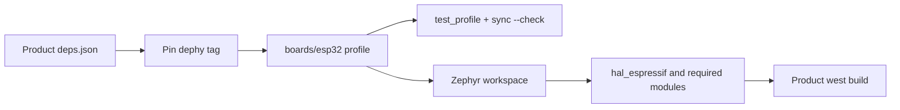
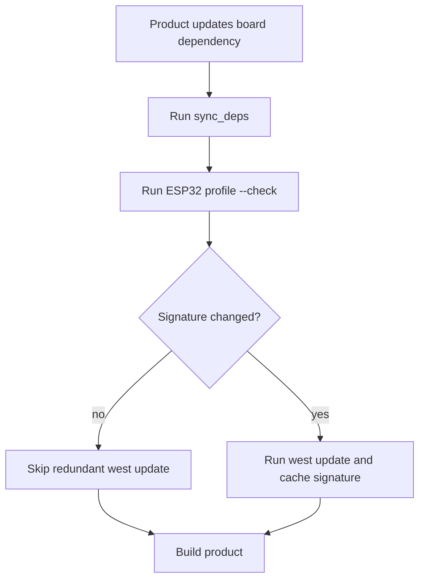

# dephy

Board-platform module for Dephy product repositories.

## Overview

`dephy` owns board profiles and Zephyr workspace setup. Product repos pin this
module, select a profile such as `boards/esp32`, and reuse the same board sync
logic locally and in CI.

## Key Value

- ESP32 profile metadata and Zephyr module list live in one reusable repo.
- `sync_zephyr_modules.sh --check` validates inputs without network/workspace
  mutation.
- Normal sync caches a module-list signature and skips redundant `west update`
  work when pins have not changed.
- Product repos can pin `dephy-vX.Y.Z` tags and reference
  `deps/dephy/boards/esp32`.

## How To Use

```sh
boards/esp32/scripts/test_profile.sh
boards/esp32/scripts/sync_zephyr_modules.sh --check
boards/esp32/scripts/sync_zephyr_modules.sh
DEPHY_FORCE_WEST_UPDATE=1 boards/esp32/scripts/sync_zephyr_modules.sh
```

ESP32 product configuration fragments live under `boards/esp32/conf/`.
`conf/product_slim.conf` is for Ethernet/MQTT field products that need Zephyr
networking but do not need POSIX compatibility or verbose runtime logging.

## Architecture Flow



## Example User Scenario



## Simple Principle

Product code owns application behavior. `dephy` owns repeatable board profile
setup and Zephyr workspace assumptions.

## Docs

- `docs/module_structure.md`: board-platform profile structure and tag policy.
- `docs/todo.md`: current TODO summary.

## License

MIT. See `LICENSE` and `NOTICE.md`. Reuse and references are allowed, but the
copyright notice and attribution to Judd (judadao) must be preserved.
